# Fondue

## Ingredients

### Fondue
- 200 g cheese mix per person (Ideal is a 50% Gruyère, 50% Vacherin Fribourgeois mix that can be found in shops in Switzerland)
- 1 dl white wine per person (Fendant wine or similar)
- 1 tbsp corn starch per 4 people
- 2-3 cl (shot glas) kirsch spirit per 4 people
- 1 clove of garlic
- black pepper to taste

### Other
- 2 handfulls of bread cut into small pieces (roughly 2x2x2 cm) per person
- fire gel / liquid for the burner (unless electric)

## Preparation

- Pour the wine into the caquelon (fondue pot). Cut the garlic in small pieces and add it to the whine. Add some black pepper to taste. Bring to a boil over the stovetop.
- Once the wine is boiling, add the cheese. Its easiest to add the cheese slowly and mix it into the wine, then once its melted add more cheese and so on. Try to avoid lumps altought there should not be any forming. Stir until all the cheese is melted.
- The cheese wine mix may be bubbling, though it should not burn.
- In a cup, combine the kirsch and corn starch, again avoiding lumps.
- Pour the kirsch-corn starch mix into the fondue. Stir well. The consistency should thicken up relatively fast. Add additional cornstarch in case desired consistency is not yet reached. Ideal consistency is when you put a spoon into the fondue and the spoon remains thinly covered after pulling out.
- Put the caquelon on the stand with the burner below on the table, and enjoy!

## Images

### Products

 <!-- the div is there so the images are side by side  -->
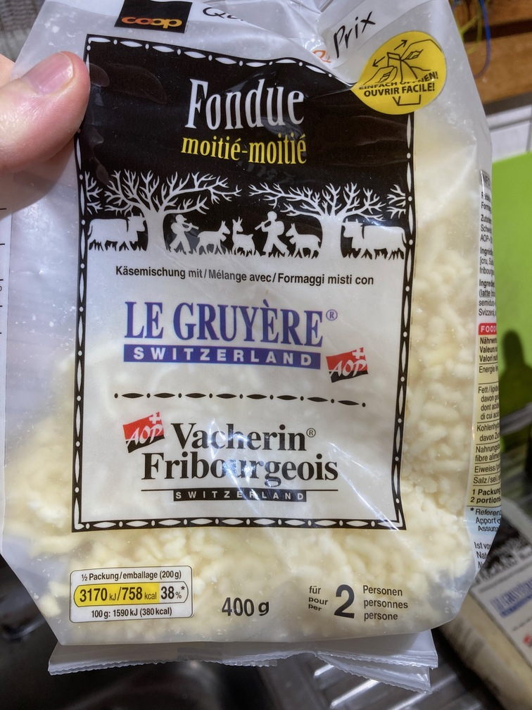

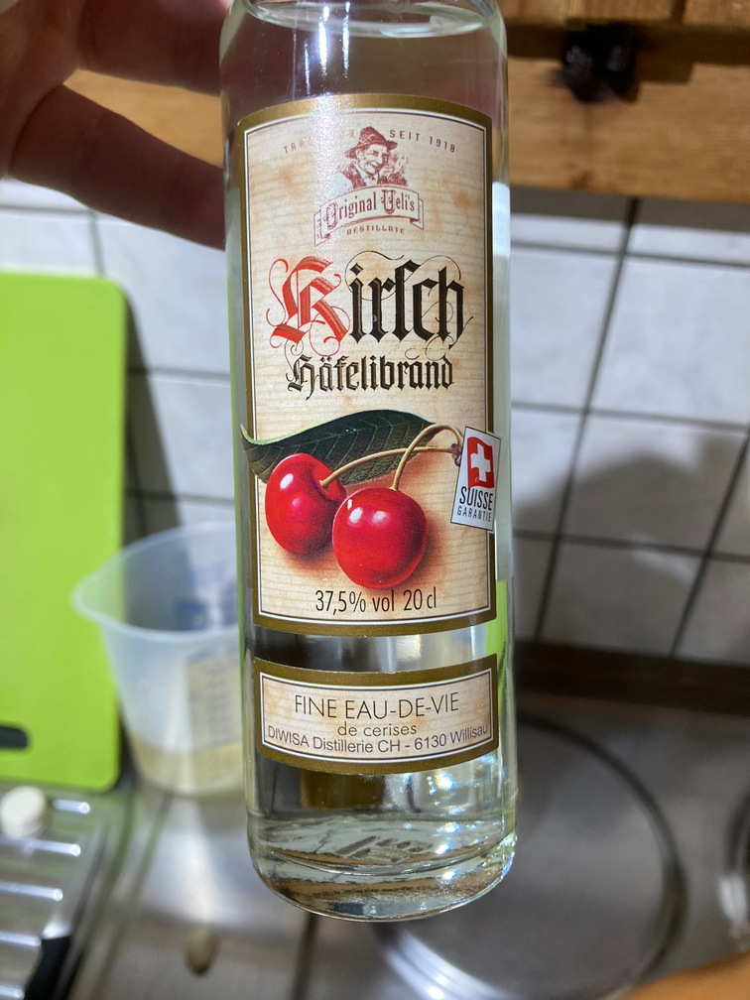
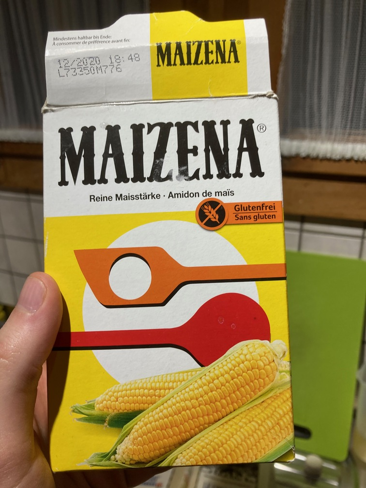
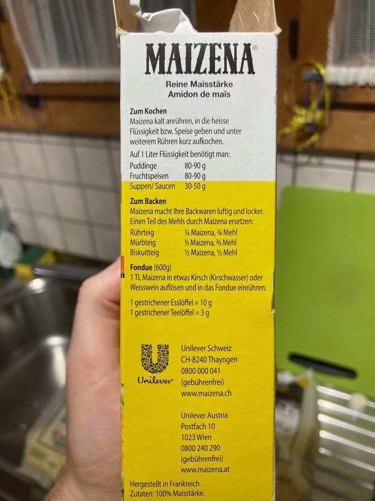
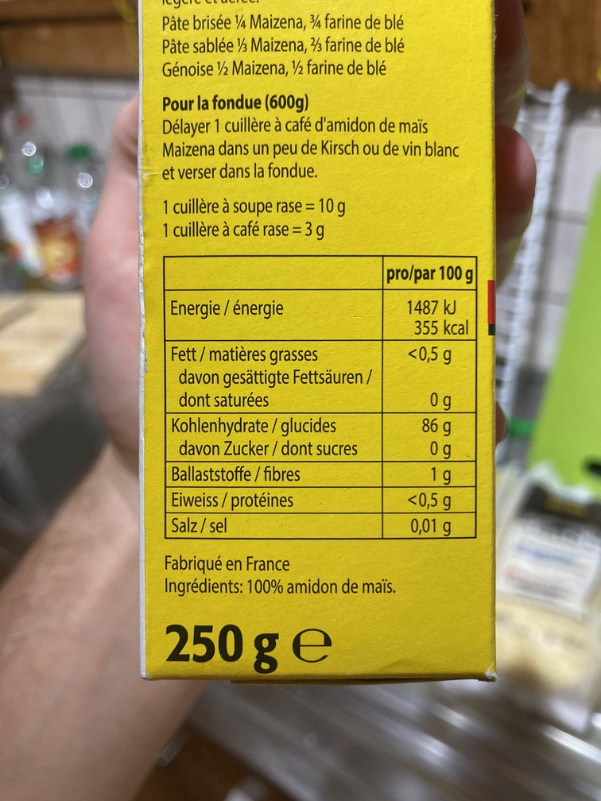

### Process

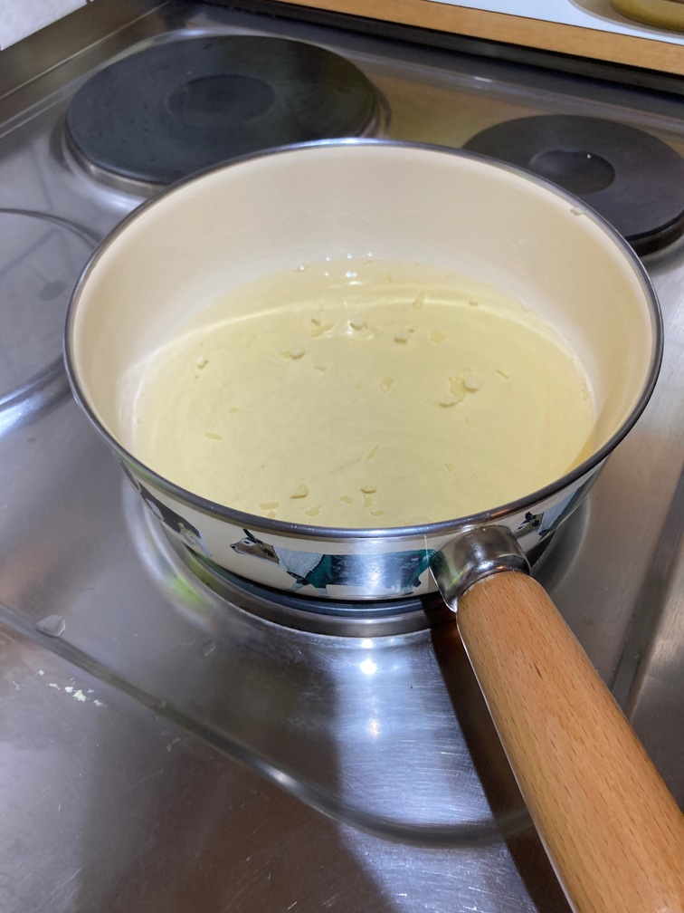

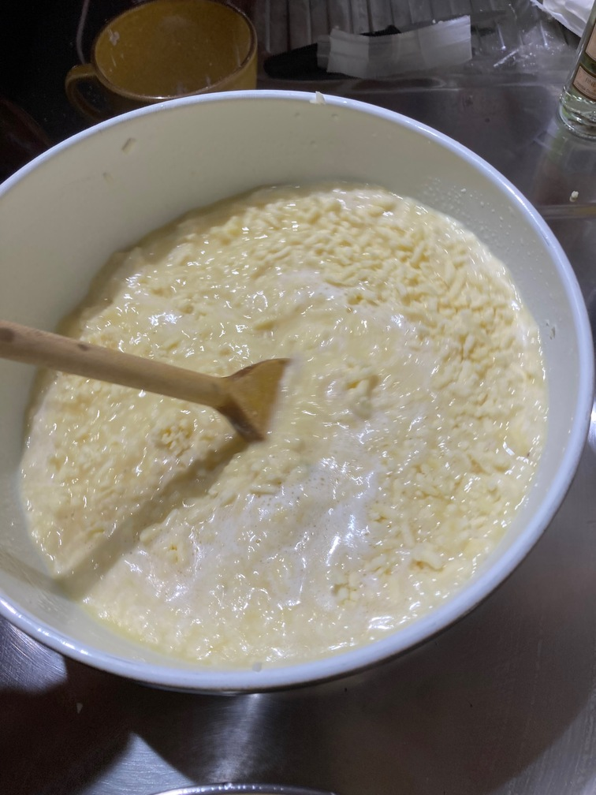
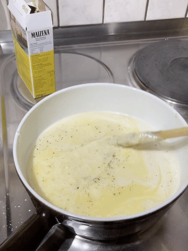
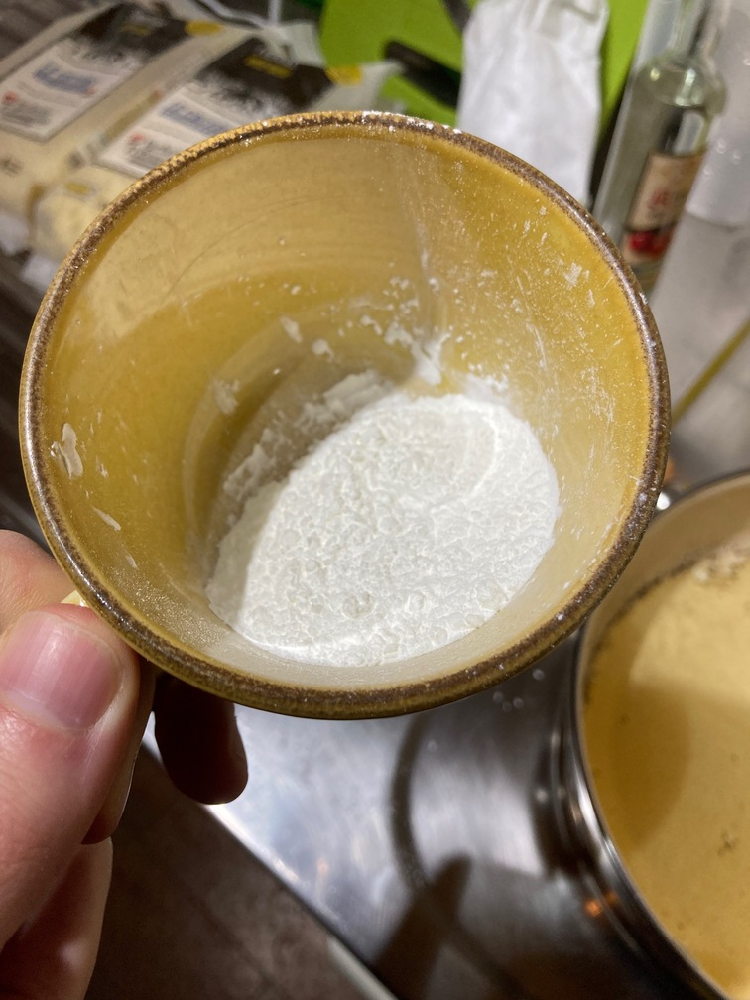

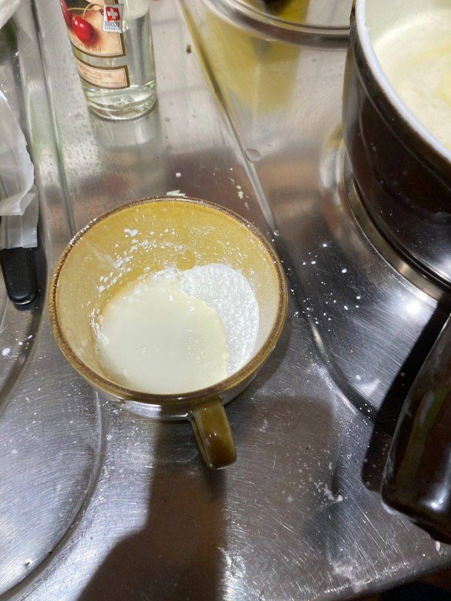

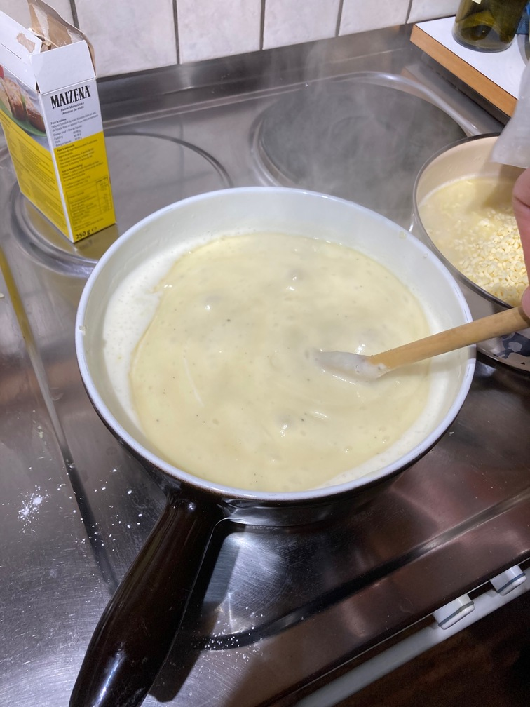

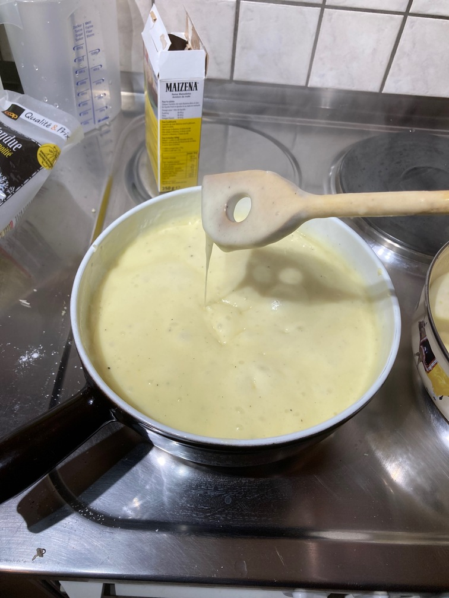
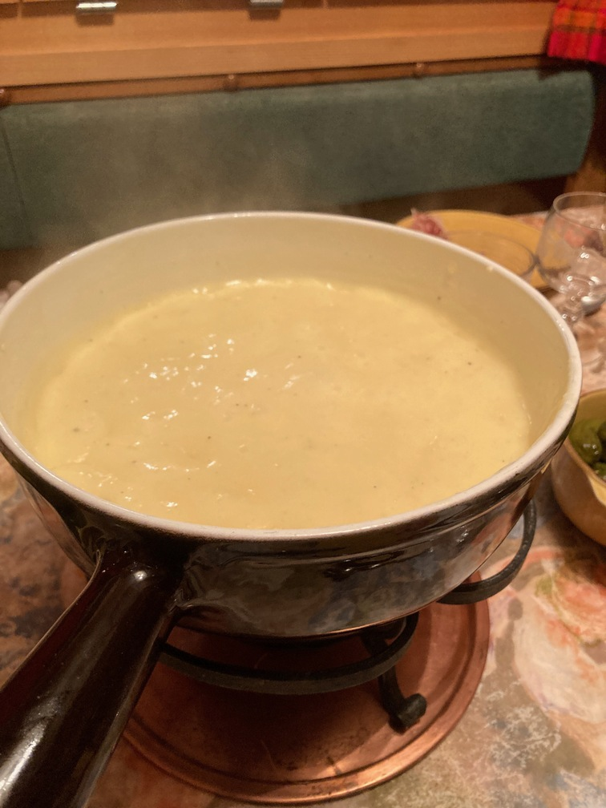

### Enjoy!

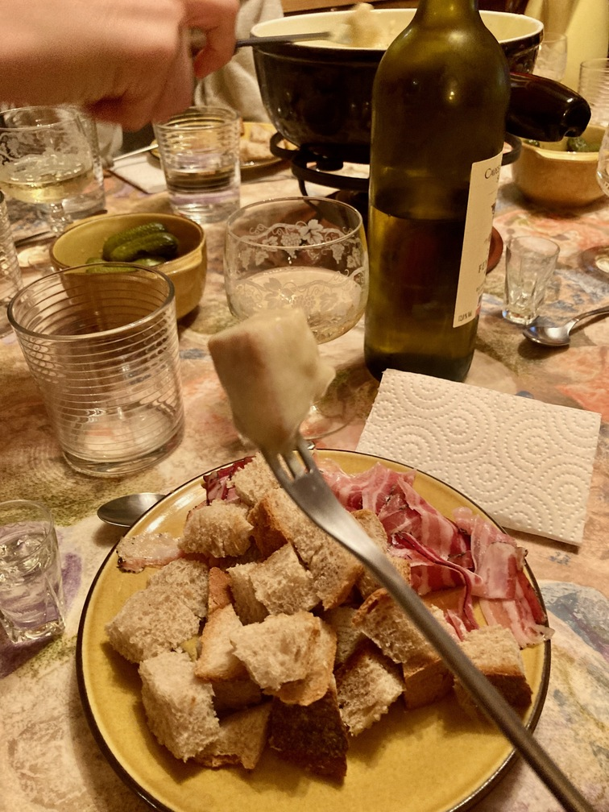

